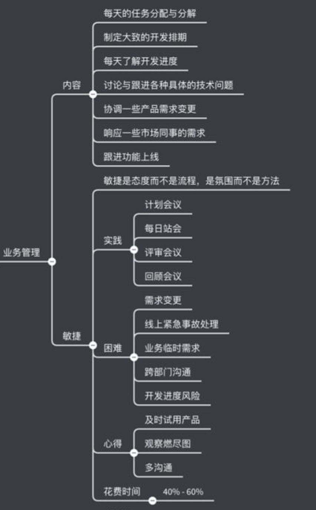
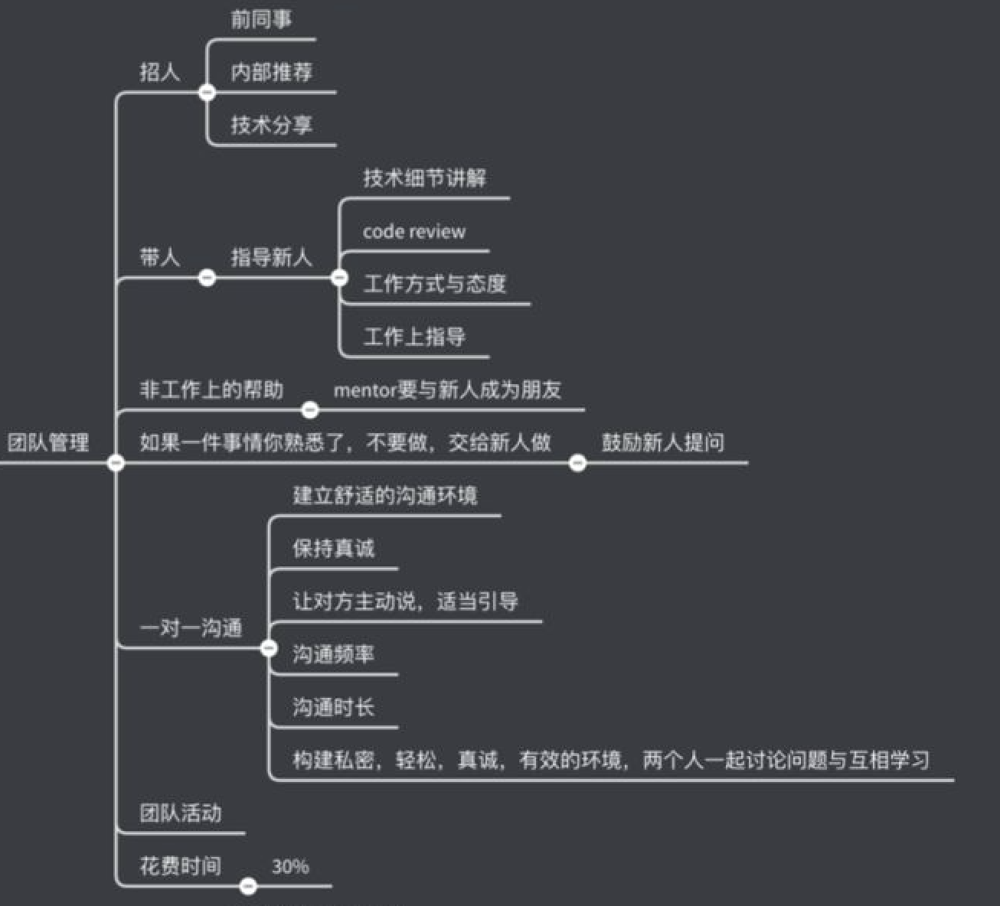
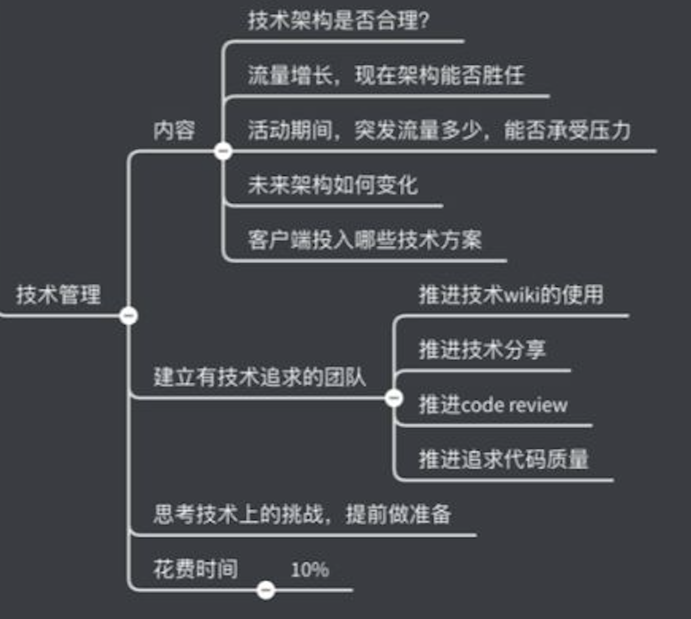

# 使用业务、组织、技术三维模型系统管理方法分析一款校园生活综合App项目的可行性

- [使用业务、组织、技术三维模型系统管理方法分析一款校园生活综合App项目的可行性](#使用业务组织技术三维模型系统管理方法分析一款校园生活综合app项目的可行性)
  - [一、业务管理](#一业务管理)
  - [二、组织管理](#二组织管理)
  - [三、技术管理](#三技术管理)
  - [四、总结](#四总结)

现拟开发一款校园生活综合App，旨在提升学校师生校园生活效率。其主功能是：面向校内人员的即时通讯，可通过学号、工号和姓名等直接找到对应的用户进行交流。此外，App内还有众多提升校园生活效率的服务（涵盖日常生活、行政办事、学习与科研和职业规划发展），这些服务以App内小程序的形式供用户使用。

设定该App由数据科学与计算机学院开发、运营。在此从业务管理、组织管理和技术管理三个角度出发，讨论这样一个校园生活综合App项目的可行性；并且给出一位后端转管理的前辈基于公司背景对团队管理的思考，以作参考。

## 一、业务管理
人力方面：该项目在院内开发、校内使用，所以项目团队可以由学院老师、学生和学院行政工作人员组成。立项后可在学院网站、学院群和学院公众号等发布招募启事。

财务方面：该目旨在提升全校师生的校园生活效率，符合学校“建设世界一流大学”的战略目标，可由学院向学校申请项目资金。项目资金可用于购置开发、运维的硬件设备，还可用于项目团队成员的工资、补贴发放。

生产方面：由于学生开发人员平时有课程安排，所以考虑以不强制坐班的方式进行生产，团队定期召开例会跟踪、总结进度并布置接下来的任务。

运营方面：可以为该项目创建邮箱、公众号等，用户可以通过这些方式向项目团队反馈信息。项目团队中可以设经理岗，专门负责产品运营。

后端转管理的前辈基于公司场景对于业务管理的思考：

## 二、组织管理
项目团队的组织结构、职务与职位等设定可以参考互联网公司事业部门的安排。其中管理层面的职位优先考虑由学院老师、学院行政工作人员担任。开发团队中相对高层的职位优先考虑由高年级学生担任。

后端转管理的前辈基于公司场景对于组织管理的思考：

## 三、技术管理
直接寻人、即时通讯的功能，现有的各种企业办公App中都有运用。小程序生态也能在现有App上看到，如微信、支付宝等。技术人员可以参考这些现有App的功能实现方法，在团队老师的指导下进行开发。如有必要，还可聘请校外公司工作人员作为顾问。

后端转管理的前辈基于公司场景对于技术管理的思考：

## 四、总结
总的来说，该项目院内开发、校内使用的特点使得项目业务管理变得较为简单，没有投资、人才等方面的竞争，许多方面在学院、学校的体系下被简化。项目的组织管理可以参考当今互联网公司的设定。技术上可以参考现有的App，此外还有学院老师的指导。大体看来该项目的可行性较高。