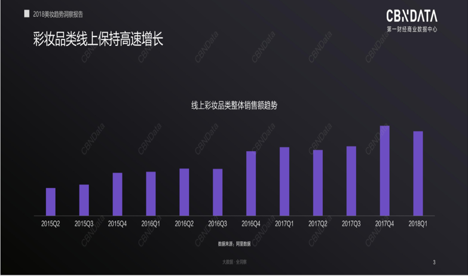
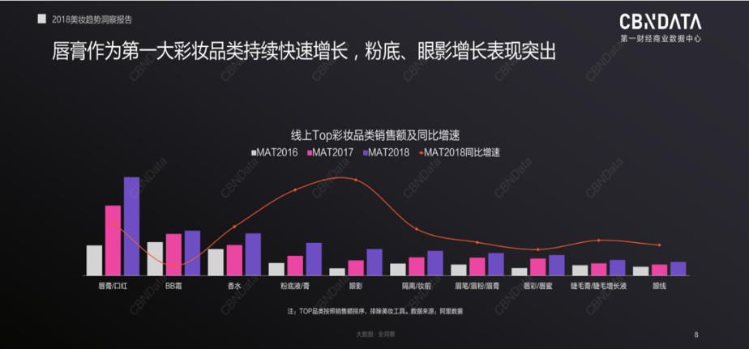

# 项目管理过程、领域知识以及二者间关系

- [项目管理过程、领域知识以及二者间关系](#%e9%a1%b9%e7%9b%ae%e7%ae%a1%e7%90%86%e8%bf%87%e7%a8%8b%e9%a2%86%e5%9f%9f%e7%9f%a5%e8%af%86%e4%bb%a5%e5%8f%8a%e4%ba%8c%e8%80%85%e9%97%b4%e5%85%b3%e7%b3%bb)
  - [一、对比项目规划过程组与CMMI-PP过程](#%e4%b8%80%e5%af%b9%e6%af%94%e9%a1%b9%e7%9b%ae%e8%a7%84%e5%88%92%e8%bf%87%e7%a8%8b%e7%bb%84%e4%b8%8ecmmi-pp%e8%bf%87%e7%a8%8b)
    - [1. 知识域*过程矩阵](#1-%e7%9f%a5%e8%af%86%e5%9f%9f%e8%bf%87%e7%a8%8b%e7%9f%a9%e9%98%b5)
    - [2. 项目规划过程组与行业过程PP的联系与区别](#2-%e9%a1%b9%e7%9b%ae%e8%a7%84%e5%88%92%e8%bf%87%e7%a8%8b%e7%bb%84%e4%b8%8e%e8%a1%8c%e4%b8%9a%e8%bf%87%e7%a8%8bpp%e7%9a%84%e8%81%94%e7%b3%bb%e4%b8%8e%e5%8c%ba%e5%88%ab)
  - [二、软件创新赛项目Business Case](#%e4%ba%8c%e8%bd%af%e4%bb%b6%e5%88%9b%e6%96%b0%e8%b5%9b%e9%a1%b9%e7%9b%aebusiness-case)

## 一、对比项目规划过程组与CMMI-PP过程
### 1. 知识域*过程矩阵
画出矩阵如下所示：

（若矩阵表无法完全显示，可以横向滑动表区域以查看完整内容，或者在[Github仓库页面](https://github.com/MIllionBenjamin/IT-Project-Management/blob/master/homework3/content.md)查看）

|                    	|                                                                                                                      	|                                                         	|                                                    	|                          	|
|--------------------	|----------------------------------------------------------------------------------------------------------------------	|---------------------------------------------------------	|----------------------------------------------------	|--------------------------	|
| 十大知识领域       	| 规划过程组                                                                                                           	| SG1                                                     	| SG2                                                	| SG3                      	|
| 4. 项目整合管理    	| 4.2制定项目管理计划                                                                                                  	| SP1.2估算工作成果和项目属性                             	| SP2.5 知识和技能的计划  SP2.7 制定项目计划   	| SP3.1 审查从属计划       	|
| 5. 项目范围管理    	| 5.1规划范围管理  5.2收集需求  5.3定义范围  5.4创建WBS                                              	| SP1.1估算项目范围   SP1.3 定义项目生产周期阶段 	|                                                    	|                          	|
| 6. 项目进度管理    	| 6.1规划进度管理  6.2定义活动  6.3排列活动顺序  6.4估算活动持续时间  6.5制定进度计划          	|                                                         	| SP2.1 编制预算和进度                               	| SP3.2 协调工作与资源配置 	|
| 7. 项目成本管理    	| 7.1规划成本管理  7.2估算成本  7.3制定预算                                                                	| SP1.4估算工作量和成本                                   	| SP2.1 编制预算和进度                               	|                          	|
| 8. 项目质量管理    	| 8.1规划质量管理                                                                                                      	|                                                         	|                                                    	|                          	|
| 9. 项目资源管理    	| 9.1规划资源管理  9.2估算活动资源                                                                               	|                                                         	| SP2.3 项目数据的管理计划  SP2.4 规划项目资源 	| SP3.2 协调工作与资源配置 	|
| 10. 项目沟通管理   	| 10.1规划沟通管理                                                                                                     	|                                                         	| SP2.3 项目数据的管理计划                           	|                          	|
| 11. 项目风险管理   	| 11.1规划风险管理  11.2识别风险  11.3实施定性风险分析  11.4实施定量风险分析  11.5规划风险应付 	|                                                         	| SP2.2 识别项目风险                                 	|                          	|
| 12. 项目采购管理   	| 12.1规划采购管理                                                                                                     	|                                                         	|                                                    	|                          	|
| 13. 项目干系人管理 	| 13.2规划相关方参与                                                                                                   	|                                                         	| SP2.6项目干系人和介入计划                          	| SP3.3 获得计划承诺       	|

### 2. 项目规划过程组与行业过程PP的联系与区别

对比 各SP的内容 与 项目规划过程组在各知识领域的内容，各SP的内容 与 其他过程组在各知识领域的内容，可以发现：

一些SP的内容恰好关联项目规划过程组在某知识领域内的内容。例如 `SP2.2 识别项目风险` 与 规划过程组的`11.2识别风险`

一些SP的内容可能不能很好地关联规划过程组在某领域的内容，但这些SP的内容可以关联其他过程组在该领域的内容。例如 `SP2.5 知识和技能的计划` 与 执行过程组的`4.4管理项目知识`。

一些SP内容可能对应过程组在不同领域的内容，因而可以出现在超过一个知识领域中。例如`	SP2.1 编制预算和进度`在`6. 项目进度管理`中，也在`7. 项目成本管理`中。

## 二、软件创新赛项目Business Case
这里给出两个样例，分别是：
1. IT项目管理课程的小组（我担任组长）项目：校园生活效率提升App: SYSU Campus Life - All in One
2. 第十四届中山大学软件创新大赛 中山大学NICE团队（我担任队长） 参赛项目：“白月光”美妆贴士App

### 1. 校园生活效率提升App: SYSU Campus Life - All in One

项目名：校园生活效率提升App: SYSU Campus Life - All in One

项目范围：中山大学校内

项目时间：2020年9月-2021年6月

成本约束：30万人民币以内

发起者：数据科学与计算机学院

业务场景：提升校园生活效率，涵盖日常生活、行政办事、学习与科研、职业规划发展这些场景下的服务。

项目预期：产出一个App，集成现有各项校园服务功能；融合新功能；能高效地添加新功能；对各项功能进行明确分类。功能多样，模块清晰，简单易用。

该项目能解决现有校园生活软件服务的以下问题：
- 功能分布零散。各项功能散布在不同的平台。
- 功能不全。一些实用的功能目前还没有实现，亟需添加。

该项目可以让中山大学的师生员工在校日常生活变得非常高效，还能提升服务对象的教学、学习、科研、办事等效率。符合学校建设世界一流大学的战略目标。

### 2. “白月光”美妆贴士App
项目名：“白月光”美妆贴士App

项目范围：面向市场

项目时间：2018年9月-2019年6月

成本约束：25万人民币以内

发起者：中山大学NICE团队

市场机会：

近年来在中国经济快速发展的情况下，化妆品行业也一直保持着快速增长。据Euromonitor资料显示，护肤品在2017年零售额达1,867亿元(人民币，下同)，彩妆为344亿元，同时护肤品和彩妆的同比增长率分别为10.3%和21.3%。据国家统计局资料显示，近年来限额以上批发和零售业化妆品的零售额如下（资料来源：中国国家统计局）：

| 年份 	| 零售额(亿元) 	|
|------	|--------------	|
| 2012 	| 1,340        	|
| 2013 	| 1,625        	|
| 2014 	| 1,825        	|
| 2015 	| 2,049        	|
| 2016 	| 2,222        	|
| 2017 	| 2,514        	|

根据贸发局2016年《中国护肤品及化妆品消费者调查》，内地女性逐渐养成化妆习惯，特别是年轻(20-30岁)的女性受访者(88%)，她们有化妆习惯的比例较成熟(31-45岁)受访者(83%)高。

不难看出，美妆在女性群体中的热度极高，且随着时间发展，美妆的热度有增无减。得益于互联网的发展和智能设备、社交媒体的普及，越来越多的女孩开始在她们的智能设备上通过互联网浏览各类美妆教程。在受年轻女性欢迎的App“小红书”中，只搜索“口红”即会出现98.6万篇相关文章；在时下流行的视频网站bilibili中，搜索“美妆教程”，会发现有至少一千个观看量超过13万的美妆教程视频。

__几乎每个年轻女性，都想高效地寻找最适合自己的美妆产品，了解到最合适自己的美丽妆容。她们在美妆方面，并不会过于吝惜金钱。__

根据CBNData《报告》显示，近年来线上彩妆品类销售额持续高速增长。其中年轻女性属线上彩妆品类的核心消费群体，且消费力超群，尤其是90后女性消费者不论从人数占比还是消费额占比，均属不同代际女性中最高。

并且，CBNData《报告》还显示，口红是2018年线上彩妆的第一大品类，同时也是是消费者线上购买彩妆的第一选择，呈现着越买越多的趋势。按消费者代际来看，2018年整体线上美妆消费者一年平均购买3.3支口红，80后和85后消费者年均购买的口红数量最多；90后美妆消费者则贡献了最多的销售额，属最舍得为口红买单的消费群。

显而易见，广大消费者对美妆产品趋之若鹜。消费者对美妆产品只增不减的强烈热情，一定会使“美妆推荐”的相关功能、业务变得大受欢迎。

业务场景：

“白月光”美妆贴士App的主要面向人群为18-35岁的青年女性，帮助她们在日常生活中挑选适合自己的美妆产品，交流、分享美妆心得。同时，我们这款App也是一部让各个年龄段的男女性为朋友亲人挑选美妆礼物的“指南”。

项目预期：

App会即时读入人脸、分析相关数据，并根据人脸数据为其匹配最合适的化妆品或妆容，例如根据肤色等特征匹配最合适的口红色号、根据脸型发型等匹配最合适的妆容，然后给用户反馈化妆品产品图片及相关信息，或是相关妆容效果图。用户还可以输入诸如“参加晚会”“着正装”这些额外信息，作为额外的参数来修正App反馈的结果。

此外，还将考虑加入即时虚拟妆容的功能。在App中内置各种化妆品信息，对于传入的人脸，用户可在App内用“化妆品”即时为其“化妆”并查看效果。

并且，我们可以考虑在后期为该App添加网络社区的功能。用户可以发布与化妆品使用体验、使用方法相关的文章，用户间可以进行评论等交互。

白月光”美妆贴士App根据人脸数据推荐化妆品的功能，会以极强的针对性向用户推荐美妆产品，大大提升用户寻找合适化妆品的效率；推荐妆容的功能，解决了用户纠结于化何种妆容的问题，帮助用户快速选择合适的妆容；虚拟妆容的功能则给予用户方便的产品试用体验；而后期的社区化不仅能完善用户体验，避免“知道适合用什么但不敢用、不会用”的问题，还能为App本身提供更多的发展机遇。

得益于它高效且针对性极强的化妆品推荐功能，“白月光”美妆贴士App会成为各大美妆品牌的推广圣地。该App可以在给用户反馈推荐结果时突出显示某种品牌的化妆品图片及信息，直接推送品牌下最适合用户的产品到用户面前，甚至还可连接到购买页面，这样的推广方式效率极高。

总而言之，“白月光”美妆贴士App将会充分挖掘“美妆推荐”相关服务的巨大潜力，成为广大爱美人士不可缺少的手机App，为各大美妆品牌提供高效优质的推广服务，还能一并解决让不少人头疼的“选什么礼物”的问题。
