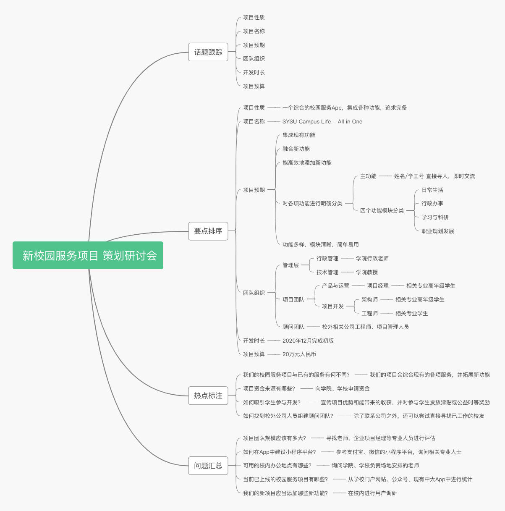

# 分析与工具 练习

- [分析与工具 练习](#分析与工具-练习)
  - [一、MYH公司的休闲和健康网站项目章程](#一myh公司的休闲和健康网站项目章程)
  - [二、项目策划研讨会思维导图](#二项目策划研讨会思维导图)
    - [1. 思维导图展示](#1-思维导图展示)
    - [2. 思维导图优缺点分析](#2-思维导图优缺点分析)
  

## 一、MYH公司的休闲和健康网站项目章程

______

**项目名称**：休闲和健康网站项目

**授权日期**：6月1日

**项目开始日期**：6月1日 
           
**项目结束日期**：12月1日

______

**关键日期里程碑**：
- 8月1日前，完成第1版网站应用开发，实现本项目的各项基础架构，以及活动通知发布、活动参与登记的功能
- 10月1日前，完成第2版网站应用开发，实现在线健康课程、在线健康项目的发布与学习功能
- 12月1日前，完成第3版网站应用开发，实现员工参与情况的数据追踪、统计，并实现奖励机制

------

**预算**：该项目预算为20万美元，可能会根据需要增资。项目主要成本为内部开发团队和外部顾问的人工费用。服务器、开发用计算机等硬件以及内部网络服务使用公司现有的设备与服务。

------

**项目经理**：Million Benjamin, (+86) 12345678901, mbenjamin@myh.com

------

**项目目标**：于6个月内，在现有的网络上再提供一个帮助员工改善健康状况的应用程序。在该应用投入使用后的1年内帮助提高员工健康状况，使得公司可以与保险商商讨较低的医疗保险费用。并在接下来4年里平均每年每名全职员工净节省30%。

------

**项目成功主要标准**：应用完整地实现预期功能，各项功能与预期功能说明一致，并通过全面测试，准时完成。由公司CEO正式批准，并附上其他关键利益相关的意见。

------

**方法**：
- 尽快组建开发团队。包括前端开发人员、后端开发人员、运维人员及测试人员。
- 三周内，制作工作分解结构（WBS），范围描述和甘特图，详细说明完成休闲和健康网站项目、实现预期各项功能需要做的工作。
- 硬件、网络服务、开发工具等使用公司现有的软硬件和服务。
- 每周与项目核心团队和发起者开进度审核会。
- 根据批准的测试计划全面测试项目功能。

------

**项目角色及职责**

|       姓名       	|    角色    	|    职位    	|      联系方式     	|
|:----------------:	|:----------:	|:----------:	|:-----------------:	|
|       Alice      	|   发起人   	|   发起人   	|   alice@myh.com   	|
| Million Benjamin 	|  项目经理  	|    经理    	| mbenjamin@myh.com 	|
|       Chloe      	| 项目组成员 	| 后端工程师 	|   chloe@myh.com   	|
|       David      	| 项目组成员 	| 后端工程师 	|   david@myh.com   	|
|       Eric       	| 项目组成员 	| 前端工程师 	|    eric@myh.com   	|
|       Frank      	| 项目组成员 	| 前端工程师 	|   frank@myh.com   	|
|      George      	| 项目组成员 	| 运维工程师 	|   george@myh.com  	|
|       Hill       	| 项目组成员 	| 测试工程师 	|    hill@myh.com   	|

------

**签署人**：（上述全部利益相关者签名）

Alice
 
Million Benjamin
 
Chloe
 
David
 
Eric
 
Frank
 
George 
 
Hill

------

**意见**（由上述利益相关者手写或打印）

Alice:

*“本项目将会对削减公司支出起到很大作用，我会密切关注这个项目，并积极配合大家的工作。希望我们共同努力，成功完成项目。”*

Million Benjamin:

*“我会尽到项目经理的职责，合理安排各项工作，期待与大家一同奋斗，完成这项任务。”*

Hill:

*“我有丰富的项目测试经验，我会针对项目的各个部分提出合理的测试计划并进行功能测试。有任何需要或者疑问，请与我联系”*

------

## 二、项目策划研讨会思维导图

### 1. 思维导图展示
一款校园服务项目的策划研讨会思维导图如下所示：

### 2. 思维导图优缺点分析

优点：
- 增进理解和记忆能力。思维导图追求图文并重，阅读者可以把关键字和颜色、图案和分布位置联系起来。思维导图顺应大脑的自然思维模式，将思维结构展现出来。
- 具有极大的可伸缩性。导图的绘制不拘泥于形式，从中心点出发，每有一条关键数据就从中心点上分出一个节点，节点数量没有约束，可以无限延伸。
- 简洁明朗。思维导图不拘泥于问题的细节，直接切入要害，找出本质，把本质以关键词的方式记录下来。

缺点：
- 不能表达详细复杂的内容。思维导图是一种发散且分层展示的图示，不便于表达复杂的信息内容。
- 对搜索不友好。一般思维导图导出成图片，所以对搜索不友好，不能根据文档内容搜索。
- 分享传播有局限。图片或PDF格式分享，手机屏幕太小，需要手指不停地上下左右拨动。他人难以二次编辑。公开发布有可能被压缩至不可读。
- 可能会让人沉溺于思维导图的制作和填充，反而被限制思维，降低个人工作效率。

总的来说，思维导图有很大的优点，学习如何绘制、阅读思维导图很有必要。但不要因此拘泥于制作、填充思维导图，应综合辅以鱼骨图、SWOT、甘特图等其他图示，以完整、高效地表达信息。

